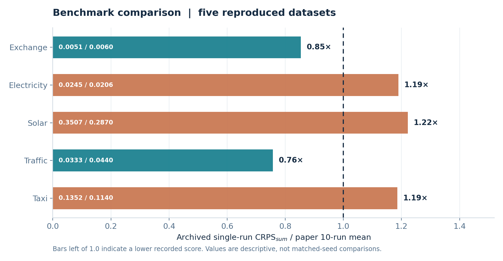
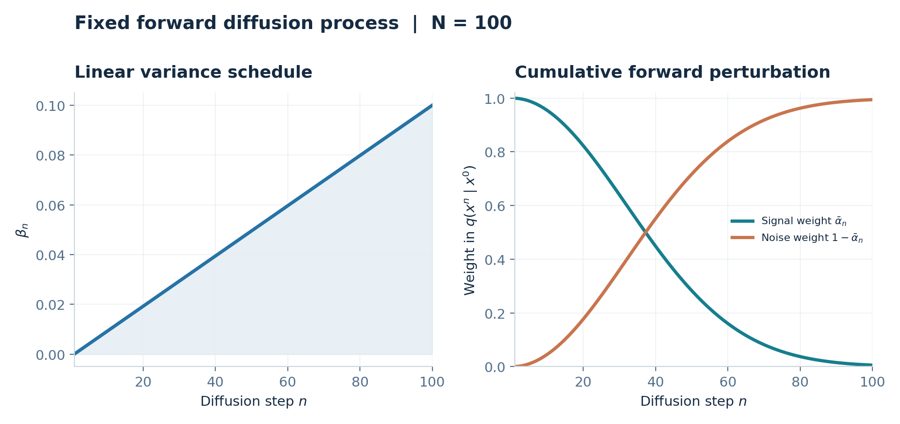
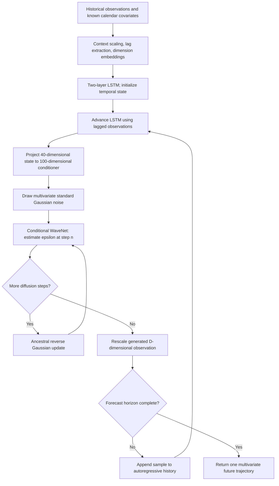
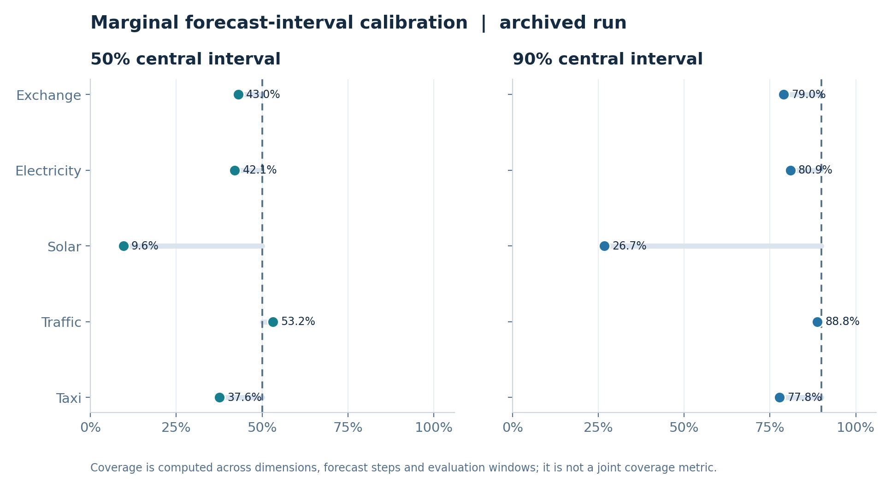
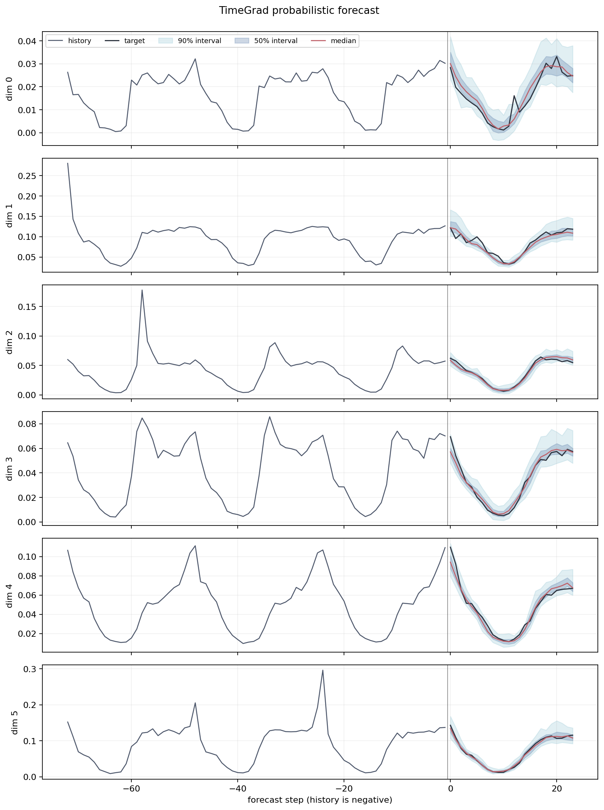
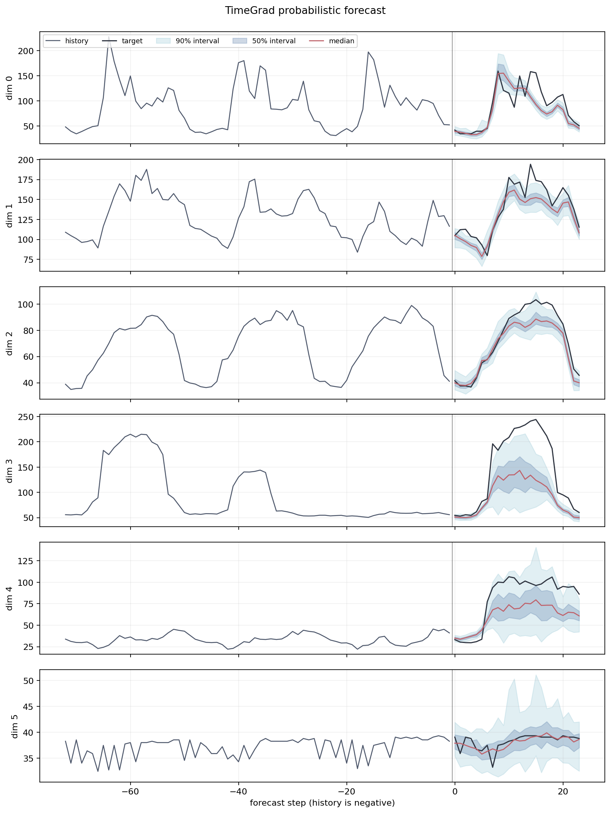
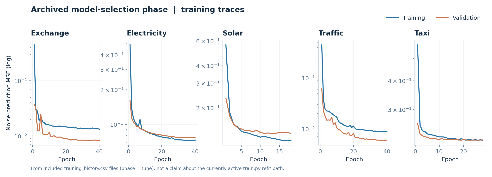

# TimeGrad

### Autoregressive Denoising Diffusion for Multivariate Probabilistic Time-Series Forecasting

**A research-oriented PyTorch reproduction of Rasul et al. (ICML 2021)**

[](https://www.python.org/)
[](https://pytorch.org/)
[](https://proceedings.mlr.press/v139/rasul21a.html)
[](#benchmark-datasets)

[**Paper**](https://proceedings.mlr.press/v139/rasul21a.html) · [**PDF**](https://proceedings.mlr.press/v139/rasul21a/rasul21a.pdf) · [**Original authors' implementation**](https://github.com/zalandoresearch/pytorch-ts/tree/master/pts/model/time_grad) · [**Quick start**](#getting-started) · [**Results**](#experimental-results)

> **Scope.** This repository implements the TimeGrad methodology in a modular PyTorch codebase rather than importing the original PyTorchTS estimator. It covers five of the six datasets reported by Rasul, Seward, Schuster, and Vollgraf: **Exchange, Solar, Electricity, Traffic, and Taxi**. The archived metrics displayed here come from **one saved run per dataset**, whereas the ICML paper reports aggregates over **ten independent runs**. They must not be interpreted as a statistically matched reproduction of Table 2.



<sub>Figure 1. Ratio of archived single-run normalized CRPS<sub>sum</sub> to the ten-run TimeGrad mean reported in Table 2 of the paper. Values below 1 indicate lower recorded error; this is a **descriptive** comparison, not a significance test. Data: [`benchmark_snapshot.csv`](assets/readme/benchmark_snapshot.csv).</sub>

## Contents

- [Research motivation](#research-motivation)
- [Mathematical formulation](#mathematical-formulation)
- [Architecture and implementation](#architecture-and-implementation)
- [Benchmark datasets](#benchmark-datasets)
- [Evaluation protocol and metrics](#evaluation-protocol-and-metrics)
- [Experimental results](#experimental-results)
- [Getting started](#getting-started)
- [Reproducibility, fidelity, and limitations](#reproducibility-fidelity-and-limitations)
- [Repository structure](#repository-structure)
- [References and citation](#references-and-citation)

---

## Research motivation

Multivariate forecasting requires a model of **future joint distributions**, not merely point estimates for individually predicted series. In applications such as energy demand, traffic systems, and financial analysis, marginal uncertainty can be insufficient: dependencies between dimensions affect the distribution of *aggregated* demand, simultaneous extremes, and downstream decisions.

TimeGrad [1] separates this problem into two coupled components:

1. An **autoregressive recurrent state** summarizes historical observations and known temporal covariates.
2. A **conditional denoising diffusion process** models the full multivariate observation distribution at each time step, given that recurrent state.

This architecture replaces a restrictive parametric emission head (e.g., a diagonal Gaussian or low-rank Gaussian) with a learned, non-Gaussian generative process. Joint future scenarios are generated **sequentially**: each newly sampled vector is fed back into the temporal model before the next forecast step.

### What this implementation contains

| Component | Implementation | Location |
|:--|:--|:--|
| Temporal dynamics | Two-layer LSTM, hidden size 40 | [`models/model.py`](models/model.py) |
| Conditional emission | DDPM with 100 noise levels | [`models/diffusion.py`](models/diffusion.py) |
| Noise predictor | Eight-block gated, dilated 1-D WaveNet | [`models/components.py`](models/components.py) |
| Historical context | Dataset-specific lags, Fourier calendar features, dimension embeddings | [`data/data_loader.py`](data/data_loader.py), [`models/model.py`](models/model.py) |
| Scale handling | Per-dimension context mean absolute scaling; disabled for Traffic | [`models/model.py`](models/model.py) |
| Optimization | Adam, validation-based model selection, gradient clipping, optional CUDA AMP | [`scripts/train.py`](scripts/train.py) |
| Probabilistic assessment | Rolling windows; 100 trajectories; normalized 19-quantile CRPS<sub>sum</sub> | [`scripts/evaluate.py`](scripts/evaluate.py), [`utils/metrics.py`](utils/metrics.py) |
| Experimental records | Saved evaluation JSON, training traces, and forecast figures in the supplied archive | `outputs/` (normally ignored by Git) |

## Mathematical formulation

### 1. Probabilistic forecasting as conditional density estimation

Consider a multivariate stochastic process with `D` jointly observed dimensions. At forecast origin `T`, we observe the history up to `T` and seek an `H`-step predictive joint distribution. Denote an *unnoised* observation by the diffusion superscript `0`:

```math
\mathbf{x}_t^{0}\in\mathbb{R}^{D},\qquad
\mathbf{x}_{1:T}^{0}=\{\mathbf{x}_1^{0},\ldots,\mathbf{x}_T^{0}\},
\qquad
\mathbf{x}_{T+1:T+H}^{0}\in\mathbb{R}^{H\times D}.
```

The chain rule gives the temporal autoregressive decomposition:

```math
p_{\theta}\!\left(\mathbf{x}_{T+1:T+H}^{0}\mid
\mathbf{x}_{1:T}^{0},\mathbf{c}_{1:T+H}\right)
=\prod_{t=T+1}^{T+H}
p_{\theta}\!\left(\mathbf{x}_t^{0}\mid
\mathbf{x}_{1:t-1}^{0},\mathbf{c}_{1:t}\right).
```

Here `c_t` comprises **known-in-advance** time covariates. The distribution of the entire `D`-dimensional vector at each step is generated *jointly*, rather than assuming independent dimensions.

### 2. Temporal conditioning and feature construction

Let `L` be the lag set, `C` the recurrent context length, and `s` a per-dimension scale estimated exclusively from the available context. For target dimension `j`:

```math
s_j=\begin{cases}
\displaystyle\frac{1}{C}\sum_{u=T-C+1}^{T}|x_{u,j}^{0}|,
&\text{if the mean is positive},\\[6pt]
1,&\text{otherwise}.
\end{cases}
```

The LSTM input concatenates normalized lagged observations, learned *dimension-identity* embeddings, and calendar Fourier features. With a compact notation for the input construction:

```math
\mathbf{u}_t=\operatorname{concat}\!\left(
\left\{\mathbf{x}_{t-\ell}^{0}\oslash\mathbf{s}:\ell\in L\right\},
\operatorname{vec}(E_{1:D}),\mathbf{c}_t\right),
\qquad
\mathbf{h}_t=\operatorname{LSTM}(\mathbf{u}_t,\mathbf{h}_{t-1}),
\qquad
\mathbf{r}_t=W_c\mathbf{h}_t+\mathbf{b}_c.
```

The implementation uses a two-layer LSTM with **40 hidden units** and maps its state to a **100-dimensional conditioner**. The time features are sinusoidal encodings of frequency-dependent calendar attributes. The lag configuration is dataset-specific; it is **not** universally `[1, 24, 168]`.

Importantly, the conditioning state for time `t` uses past observations through lagged inputs; the current observation `x_t` is the *target* of the conditional denoising objective, not a leaked input.

### 3. Forward diffusion (fixed noising distribution)

Within each forecast time step, let `n` index the diffusion stage, from `1` to `N`. The **forward process** gradually perturbs a scaled clean vector with isotropic Gaussian noise:

```math
q(\mathbf{x}_t^{n}\mid\mathbf{x}_t^{n-1})
=\mathcal{N}\!\left(
\sqrt{1-\beta_n}\,\mathbf{x}_t^{n-1},\,
\beta_n I_D\right),
\qquad n=1,\ldots,N.
```

With `alpha_n = 1 - beta_n` and the cumulative product `bar_alpha_n`, its marginal is available in closed form:

```math
\alpha_n=1-\beta_n,\qquad
\bar\alpha_n=\prod_{k=1}^{n}\alpha_k,
\qquad
\mathbf{x}_t^{n}
=\sqrt{\bar\alpha_n}\,\mathbf{x}_t^{0}
+\sqrt{1-\bar\alpha_n}\,\boldsymbol\epsilon,
\quad\boldsymbol\epsilon\sim\mathcal{N}(0,I_D).
```

The fixed configuration uses **100 diffusion steps** with a linearly increasing variance schedule from **0.0001** to **0.1**. In code, steps are indexed from `0` to `99`; the equations use the conventional one-based indexing.



<sub>Figure 2. Analytical visualization of the configured forward process; this is a deterministic schedule, **not** a learned experimental result.</sub>

### 4. Conditional reverse diffusion and noise prediction

The denoiser is a neural map conditioned on the noisy multivariate sample, diffusion stage, and autoregressive state:

```math
\boldsymbol\epsilon_\theta:
(\mathbf{x}_t^{n},n,\mathbf{r}_t)\longmapsto
\widehat{\boldsymbol\epsilon}\in\mathbb{R}^{D}.
```

Instead of directly estimating the reverse Gaussian mean, the model predicts injected noise. The reverse mean follows the DDPM reparameterization [2]:

```math
\boldsymbol\mu_\theta(\mathbf{x}_t^{n},n,\mathbf{r}_t)
=\frac{1}{\sqrt{\alpha_n}}
\left(\mathbf{x}_t^{n}-
\frac{\beta_n}{\sqrt{1-\bar\alpha_n}}
\boldsymbol\epsilon_\theta(\mathbf{x}_t^{n},n,\mathbf{r}_t)\right).
```

This implementation samples using the fixed forward-posterior variance:

```math
\widetilde\beta_n
=\beta_n\frac{1-\bar\alpha_{n-1}}{1-\bar\alpha_n},
\qquad
\mathbf{x}_t^{n-1}
=\boldsymbol\mu_\theta(\mathbf{x}_t^{n},n,\mathbf{r}_t)
+\sqrt{\widetilde\beta_n}\,\mathbf{z},
\qquad\mathbf{z}\sim\mathcal{N}(0,I_D).
```

At `n = 1`, the last update is deterministic (`z = 0`). Each future vector begins from fresh standard Gaussian noise at `n = N` and is iteratively denoised to `n = 0`. The learned distribution is thereby represented **implicitly by samples** rather than a closed-form observation likelihood.

### 5. Learning objective

Training uses the standard *simplified* epsilon-prediction DDPM loss, conditional on the LSTM state. It uniformly samples the diffusion level and Gaussian perturbation:

```math
\mathcal{L}(\theta)
=\mathbb{E}_{t,\,n,\,\boldsymbol\epsilon}
\left[\left\|
\boldsymbol\epsilon-
\boldsymbol\epsilon_\theta\!\left(
\sqrt{\bar\alpha_n}\,\mathbf{x}_t^{0}
+\sqrt{1-\bar\alpha_n}\,\boldsymbol\epsilon,
n,\mathbf{r}_t\right)
\right\|_2^2\right],
\quad
n\sim\operatorname{Uniform}\{1,\ldots,N\}.
```

The equation is understood in **normalized observation space**, after applying the context-derived scale. The implementation averages mean-squared error over the batch, training target times, and dimensions. It trains on the *context-plus-prediction target positions* with **teacher forcing**; inference replaces future ground truth with recursively sampled observations.

This simplified unweighted objective is related to, but is **not numerically identical to**, the fully weighted variational negative-log-likelihood bound derived in [1, 2].

### 6. Multi-step ancestral forecasting

A single sampled scenario is generated by repeating the following procedure:



The model vectorizes `S` independent scenarios across the batch and returns a tensor with shape:

```math
\text{forecast samples}\in\mathbb{R}^{B\times S\times H\times D}.
```

For `S = 100` trajectories, `H` future time points, and `N = 100` diffusion steps, inference requires approximately `H × N` sequential denoiser updates for each vectorized batch of scenarios. This is more computationally expensive than a one-pass parametric output head, but enables flexible joint predictive distributions.

## Architecture and implementation

The WaveNet-style denoiser operates on the target dimension axis: a noisy vector is represented as `(batch, 1, D)` before conditional, circularly padded 1-D convolutions. **Dimensions have a fixed ordering**; this is a practical architectural inductive bias, not a claim that all neighboring dataset dimensions are physically adjacent.

| Property | Value | Interpretation |
|:--|:--|:--|
| LSTM | 2 layers × 40 hidden units | Autoregressive historical representation |
| RNN dropout | 0.1 | Between recurrent layers |
| Dimension embeddings | 1 learned scalar per dimension | Fixed identity features, repeated across time |
| Conditioner projection | 40 → 100 | Diffusion-network conditional representation |
| Diffusion Fourier embedding | 16 sine + 16 cosine features | Discrete noise-level representation; 500-entry lookup table |
| Diffusion embedding projection | 32 → 64 → 64 | Learned SiLU transformations |
| WaveNet residual stack | 8 blocks, 8 channels | Gated tanh/sigmoid activation and skip accumulation |
| Convolution dilation | `1, 2, 1, 2, 1, 2, 1, 2` | Two-stage dilation cycle, circular padding |
| Diffusion levels | 100 | Linear `beta` schedule; reverse-posterior variance |
| Sampling | 100 forecast trajectories | Monte Carlo quantiles and interval estimation |

The conditioner is projected from the LSTM state and upsampled across dimensions. The gated residual blocks combine the noised sample, diffusion-level embedding, and recurrent conditioning signal; residual/skip paths are aggregated to estimate injected Gaussian noise. The output projection is initialized to zero.

### Tensor conventions

| Tensor | Shape | Description |
|:--|:--|:--|
| `history` | `(B, context_length + max(lags), D)` | Sufficient past for all lagged features |
| `future` | `(B, H, D)` | Teacher-forced targets during training |
| `time_features` | `(B, C + H, F)` | Known calendar features for objective positions |
| `conditioning` | `(B × (C + H), 100)` | Flattened per-step recurrent conditioning |
| `noisy_target` | `(B × (C + H), 1, D)` | DDPM training inputs |
| `forecast` | `(B, S, H, D)` | Sampled future trajectories |

> **Indexing distinction:** the history tensor contains `context_length + max(lags)` observations, but only its most recent `context_length` target positions are used for context scaling and warm-up conditioning. Earlier points support lag retrieval.

## Benchmark datasets

The [paper's Table 1](https://proceedings.mlr.press/v139/rasul21a/rasul21a.pdf) defines six benchmarks. This code registers five of them using the GluonTS benchmark names below; **Wikipedia is not implemented**.

| Dataset | GluonTS dataset name | Dimensions `D` | Frequency | Training steps | Horizon `H` | Test windows | Scaling |
|:--|:--|--:|:--|--:|--:|--:|:--|
| Exchange | `exchange_rate_nips` | 8 | Business day | 6,071 | 30 | 5 | Yes |
| Solar | `solar_nips` | 137 | Hourly | 7,009 | 24 | 7 | Yes |
| Electricity | `electricity_nips` | 370 | Hourly | 5,833 | 24 | 7 | Yes |
| Traffic | `traffic_nips` | 963 | Hourly | 4,001 | 24 | 7 | **No** |
| Taxi | `taxi_30min` | 1,214 | 30-minute | 1,488 | 24 | 56 | Yes |

**Pipeline.** [`data/data_loader.py`](data/data_loader.py) retrieves the preprocessed GluonTS datasets, aligns individual component series, constructs multivariate observations and rolling evaluation windows, and caches the resulting arrays. It also produces frequency-aware Fourier covariates (calendar hour, weekday, minute, or day-of-year as applicable).

Dataset-specific lag sets are specified in [`config/`](config/): Exchange uses `[1, 2]`; Solar, Electricity, and Traffic use `[1, 24, 168]`; Taxi uses `[1, 4, 12, 24, 48]`. The Taxi profile additionally specifies a one-step **validation stride**, leading to overlapping validation windows. This is a repository-level setting and should be reported explicitly in any experimental comparison.

## Evaluation protocol and metrics

### Evaluation procedure

1. Train on sliding context/future windows drawn from the available training prefix.
2. Reserve trailing training observations for chronological validation, select a checkpoint by validation diffusion loss, and retain the best model state.
3. At each official test forecast origin, generate `S = 100` joint trajectories of length `H`.
4. Evaluate probabilistic scores and marginal prediction-interval coverage across the rolling windows.

The **current active training script** completes step 2 and saves its selected checkpoint. Although the configuration contains `validation.retrain_full: true`, the active code **does not subsequently refit on the complete training split**. Some archived history files and checkpoints have a `retrain_full` phase from a different/earlier execution path. See [Reproducibility, fidelity, and limitations](#reproducibility-fidelity-and-limitations) before comparing new runs with the supplied archived results.

### CRPS and CRPS<sub>sum</sub>

For a univariate predictive cumulative distribution function `F` and observation `y`, the continuous ranked probability score is:

```math
\operatorname{CRPS}(F,y)
=\int_{-\infty}^{\infty}
\left(F(z)-\mathbb{1}\{y\le z\}\right)^2\,\mathrm{d}z.
```

For multivariate trajectories, the paper evaluates the **distribution of the sum across all dimensions**, retaining the contribution of cross-dimensional dependence. At test window `w` and horizon step `t`, define:

```math
z_{w,t}=\sum_{j=1}^{D}x_{w,t,j}^{0},
\qquad
\widehat z_{w,t}^{(s)}=\sum_{j=1}^{D}\widehat x_{w,t,j}^{(s)}.
```

The reported `CRPS_sum` field in this repository uses the **normalized 19-quantile approximation** employed by the authors' GluonTS-style evaluator. For empirical quantiles `q = 0.05, 0.10, ..., 0.95`, with pinball loss `rho`, it is:

```math
\mathcal{Q}=\{0.05,0.10,\ldots,0.95\},\quad
\rho_q(u)=u\left(q-\mathbb{1}\{u<0\}\right),
```

```math
\operatorname{CRPS}_{\mathrm{sum}}^{(19q)}
=\frac{1}{|\mathcal{Q}|}\sum_{q\in\mathcal{Q}}
\frac{2\sum_{w,t}\rho_q\!\left(z_{w,t}-\widehat z_{w,t}(q)\right)}
{\sum_{w,t}|z_{w,t}|}.
```

The repository separately reports the **exact empirical-sample CRPS identity**, normalized analogously, under `empirical_CRPS_sum`:

```math
\widehat{\operatorname{CRPS}}(y)
=\frac{1}{S}\sum_{s=1}^{S}|\widehat y^{(s)}-y|
-\frac{1}{2S^{2}}\sum_{s=1}^{S}\sum_{r=1}^{S}
|\widehat y^{(s)}-\widehat y^{(r)}|.
```

These are two different **estimators/approximations** and should not be silently interchanged when reporting results. Moreover, aggregate CRPS tests the distribution of the cross-sectional **sum**, not all aspects of the full multivariate dependence structure; full-joint assessment would require additional multivariate diagnostics (for example, an energy score or variogram score).

Other metrics in `evaluation.json` are normalized deviation (`ND`), normalized RMSE (`NRMSE`), and **marginal** central 50%/90% interval coverage (across dimensions, horizons and test windows). Coverage is not a joint multivariate guarantee.

## Experimental results

### Archived single-run results vs. ICML 2021

| Benchmark | Archived CRPS<sub>sum</sub> ↓ | Paper TimeGrad CRPS<sub>sum</sub> ↓ | Archived / paper | Empirical 90% coverage |
|:--|--:|--:|--:|--:|
| Exchange | **0.00512** | 0.006 ± 0.001 | 0.85× | 79.0% |
| Solar | 0.35074 | **0.287 ± 0.020** | 1.22× | 26.7% |
| Electricity | 0.02451 | **0.0206 ± 0.0010** | 1.19× | 80.9% |
| Traffic | **0.03334** | 0.044 ± 0.006 | 0.76× | 88.8% |
| Taxi | 0.13522 | **0.114 ± 0.020** | 1.19× | 77.8% |

**Interpretation and provenance.** Archived values come from `outputs/reports/<dataset>/evaluation.json` in the supplied project snapshot; tracked plotting inputs are in [`assets/readme/benchmark_snapshot.csv`](assets/readme/benchmark_snapshot.csv). Paper figures are from **Table 2** of [1] and represent **ten-run means with the paper's reported uncertainty**, whereas each archived point is a **single run** with no reproducibility distribution. The bold entry in each row indicates the smaller *reported point value only*. This table cannot establish superiority, parity, or statistical significance, and does not certify that the active code will regenerate the archived checkpoint.

### Prediction-interval calibration



<sub>Figure 3. Archived central-interval empirical coverage, with dashed lines marking nominal 50% and 90% levels. Solar's 90% coverage is only 26.7% in the saved experiment; this indicates severe undercoverage and warrants calibration and pipeline investigation, rather than being treated as a successful probabilistic result.</sub>

### Qualitative multivariate forecasts



<sub>Figure 4. **Traffic**, first archived rolling evaluation window, first six target dimensions. The observed future and prediction median are overlaid with 50% and 90% intervals computed from simulated trajectories; the vertical boundary separates history from forecast.</sub>



<sub>Figure 5. **Electricity**, first archived rolling evaluation window, first six dimensions. These are **actual saved forecast plots** from the supplied project, not illustrative synthetic forecasts.</sub>

### Training diagnostics



<sub>Figure 6. Log-scale train and validation noise-prediction MSE from the archived `tune` phase. The saved training histories also contain `retrain_full` segments, but those are intentionally excluded here because the currently active training script does not perform that phase.</sub>

## Getting started

### Installation

The package targets **Python 3.10+** with PyTorch 2.4+, NumPy, pandas, PyYAML, Matplotlib, and GluonTS 0.16.2. A CUDA GPU is strongly recommended for full-dimensional benchmarks because ancestral inference is sequential over diffusion levels and forecast time.

```bash
# From the repository root
python -m venv .venv
source .venv/bin/activate              # Windows PowerShell: .venv\Scripts\Activate.ps1
python -m pip install --upgrade pip
python -m pip install -r requirements.txt
```

The raw benchmark datasets are **not** embedded in this README package. The loader acquires them through GluonTS on first use (network access may be required) and caches transformed data under `data/dataset/`.

### Download and inspect a benchmark

```bash
python -m scripts.main --config config/exchange.yaml --mode download
```

### Train and evaluate

```bash
python -m scripts.main --config config/exchange.yaml --mode all
```

For another supported dataset, replace `exchange.yaml` with `solar.yaml`, `electricity.yaml`, `traffic.yaml`, or `taxi.yaml`. The configured outputs are written beneath `models/saved_models/`, `outputs/reports/`, and `outputs/plots/`.

To evaluate a **previously saved, configuration-compatible checkpoint**, run:

```bash
python -m scripts.main --config config/exchange.yaml --mode evaluate
```

> **Checkpoint safety:** `--mode all` writes to the configured checkpoint path. To preserve an existing model, override `outputs.checkpoint` and corresponding report/plot paths when launching exploratory runs.

### Small diagnostic experiment

The following uses the lowest-dimensional benchmark, fewer optimizer steps, fewer trajectories, a shorter diffusion chain, and a separate output prefix. It is a **pipeline smoke run, not a paper reproduction**:

```bash
python -m scripts.main --config config/exchange.yaml --mode all \
  --set training.epochs=2 \
  --set training.steps_per_epoch=4 \
  --set training.batch_size=8 \
  --set model.diffusion_steps=10 \
  --set evaluation.num_samples=5 \
  --set evaluation.max_windows=1 \
  --set outputs.checkpoint=models/saved_models/exchange_smoke.pt \
  --set outputs.history_csv=outputs/reports/smoke/training_history.csv \
  --set outputs.evaluation_report=outputs/reports/smoke/evaluation.json \
  --set outputs.run_summary=outputs/reports/smoke/run_summary.json \
  --set outputs.loss_plot=outputs/plots/smoke/training_loss.png \
  --set outputs.forecast_plot=outputs/plots/smoke/forecast.png
```

CLI options are defined in [`scripts/main.py`](scripts/main.py). Nested YAML fields can be overridden through repeated `--set key=value` arguments.

### Independent-seed experiments

The `scripts.reproduce` CLI trains, evaluates, and aggregates separate runs. Its **current default** is **three seeds** (`0`, `10`, `20`), despite text in its docstring referring to ten. To request ten runs explicitly:

```bash
python -m scripts.reproduce --config config/electricity.yaml \
  --seeds 0 10 20 30 40 50 60 70 80 90
```

These jobs are computationally substantial. Aggregate any already-created result files using:

```bash
python -m scripts.aggregate outputs/reports/paper_runs/electricity/seed_*/evaluation.json
```

This reports the arithmetic mean, sample-based standard error, and constituent `CRPS_sum` values; it does **not** automatically correct any discrepancies between the current active training pipeline and the archived runs.

### Regenerate README plots

The plots are checked into `assets/readme/` because the repository's `.gitignore` excludes normal experiment output directories. The figure inputs are also tracked for provenance:

```bash
python assets/readme/render_plots.py
```

This script reads [`benchmark_snapshot.csv`](assets/readme/benchmark_snapshot.csv) and the archived tuning curves in [`assets/readme/data/`](assets/readme/data/). It does not download datasets, retrain a model, rerun evaluation, or synthesize forecast samples. The two qualitative forecast PNGs are copied from the archived project output.

## Reproducibility, fidelity, and limitations

This repository is best understood as a **substantial implementation of the TimeGrad architecture with a documented experimental snapshot**, not a verified exact regeneration of every published result.

| Issue | Verified status | Implication |
|:--|:--|:--|
| Original paper scope | Six datasets; this registry contains five | No Wikipedia reproduction is provided. |
| Saved experimental statistics | One archived evaluation report per dataset | Paper's ten-run uncertainty cannot be reconstructed from these points. |
| Current refitting implementation | `validation.retrain_full: true` is present, but active `train_experiment()` stops after validation-selected training | Re-running the current code is not identical to the archived checkpoints tagged `retrain_full`. |
| Independent seeds | `scripts.reproduce` defaults to three explicit seeds | Pass `--seeds` with ten values to request ten independent runs. |
| Protocol checks | `paper_protocol_complete` checks configured settings at evaluation time | This flag does not audit refitting, provenance, random-seed coverage, or numerical equivalence. |
| Forecast calibration | Significant Solar undercoverage in the saved report | Aggregate CRPS<sub>sum</sub> alone does not certify reliable uncertainty quantification. |
| Convolution geometry | Circular 1-D convolutions across a fixed dimension order | Sensitivity to arbitrary dimension permutations is a worthwhile ablation. |
| Inference cost | Sequential DDPM × autoregressive horizon | Runtime scales strongly with sampling steps, horizon, and generated trajectories. |
| Tests | `pyproject.toml` references `tests/`, but the supplied archive does not contain that directory | No shipped regression suite can be claimed; add tests before asserting continuous integration coverage. |
| Dataset and output files | Excluded by `.gitignore` | Commit `assets/readme/` to preserve README visuals and summary statistics. |

**Recommended reproducibility practice.** Record the exact Git commit, configuration, seed, package versions, evaluation-window counts, dataset preprocessing versions, checkpoint phase, and hardware for every reported run. Publish per-seed results before presenting cross-run standard errors. Report the model-selection protocol and any modifications to the scale transform, lag construction, and variance schedule. Do not infer full benchmark reproduction solely from close CRPS values.

### Research extensions

Several natural, falsifiable next experiments follow from this implementation: (i) dimension-permutation sensitivity under circular convolutions; (ii) the diffusion-length/forecast-quality/runtime Pareto frontier; (iii) post-hoc calibration and conditional coverage on low-coverage benchmarks; (iv) an explicit full-data refit ablation; (v) comparison of quantile-grid and exact sample CRPS estimators; and (vi) variance reduction across independently seeded model and forecast-sampling runs. None of these experiments is claimed to have been performed here.

## Repository structure

```text
.
├── assets/
│   └── readme/                 # tracked figures, archived metrics, plotting script
├── config/
│   ├── base.yaml               # shared model, training, and evaluation defaults
│   ├── exchange.yaml
│   ├── solar.yaml
│   ├── electricity.yaml
│   ├── traffic.yaml
│   └── taxi.yaml
├── data/
│   ├── benchmarks.py           # dataset metadata and paper reference values
│   └── data_loader.py          # download, grouping, rolling windows, covariates
├── models/
│   ├── components.py           # diffusion embedding, WaveNet, gated residuals
│   ├── diffusion.py            # forward noising, loss, ancestral sampling
│   └── model.py                # LSTM conditioner and TimeGrad model
├── scripts/
│   ├── main.py                 # download / train / evaluate / all CLI
│   ├── train.py                # optimizer, validation, checkpointing
│   ├── evaluate.py             # rolling-window probabilistic evaluation
│   ├── reproduce.py            # multiple independent-seed experiments
│   └── aggregate.py            # metrics aggregation
├── utils/
│   ├── metrics.py              # CRPS, ND, NRMSE, coverage
│   ├── visualization.py        # forecast and training plots
│   └── config.py               # configuration, paths, random seeds
├── outputs/                    # runtime artifacts; gitignored by default
├── requirements.txt
├── pyproject.toml
└── README.md
```

## References and citation

**[1]** K. Rasul, C. Seward, I. Schuster, and R. Vollgraf. **Autoregressive Denoising Diffusion Models for Multivariate Probabilistic Time Series Forecasting.** *Proceedings of the 38th International Conference on Machine Learning*, PMLR 139:8857–8868, 2021. [Paper](https://proceedings.mlr.press/v139/rasul21a.html) · [PDF](https://proceedings.mlr.press/v139/rasul21a/rasul21a.pdf) · [arXiv](https://arxiv.org/abs/2101.12072).

**[2]** J. Ho, A. Jain, and P. Abbeel. **Denoising Diffusion Probabilistic Models.** *Advances in Neural Information Processing Systems*, 2020. [arXiv](https://arxiv.org/abs/2006.11239).

**[3]** A. van den Oord et al. **WaveNet: A Generative Model for Raw Audio.** 2016. [arXiv](https://arxiv.org/abs/1609.03499).

**[4]** Z. Kong, W. Ping, J. Huang, K. Zhao, and B. Catanzaro. **DiffWave: A Versatile Diffusion Model for Audio Synthesis.** *ICLR*, 2021. [arXiv](https://arxiv.org/abs/2009.09761).

**[5]** A. Alexandrov et al. **GluonTS: Probabilistic and Neural Time Series Modeling in Python.** *JMLR*, 2020. [JMLR](https://www.jmlr.org/papers/v21/19-820.html).

**Original TimeGrad code:** [Zalando Research / pytorch-ts](https://github.com/zalandoresearch/pytorch-ts/tree/master/pts/model/time_grad). The present project is a separate reproduction and is **not represented as the original authors' software**.
